# techfeed_hub

## Tables

| Name | Columns | Comment | Type |
| ---- | ------- | ------- | ---- |
| [public.pg_stat_statements_info](public.pg_stat_statements_info.md) | 2 |  | VIEW |
| [public.pg_stat_statements](public.pg_stat_statements.md) | 43 |  | VIEW |
| [public.blog_categories](public.blog_categories.md) | 7 |  | BASE TABLE |
| [public.blogs](public.blogs.md) | 27 |  | BASE TABLE |
| [public.blog_fetch_logs](public.blog_fetch_logs.md) | 16 |  | BASE TABLE |
| [public.tag_categories](public.tag_categories.md) | 7 |  | BASE TABLE |
| [public.tags](public.tags.md) | 14 |  | BASE TABLE |
| [public.article_tags](public.article_tags.md) | 4 |  | BASE TABLE |
| [public.users](public.users.md) | 32 |  | BASE TABLE |
| [public.user_sessions](public.user_sessions.md) | 14 |  | BASE TABLE |
| [public.user_blog_follows](public.user_blog_follows.md) | 3 |  | BASE TABLE |
| [public.security_audit_logs](public.security_audit_logs.md) | 19 |  | BASE TABLE |
| [public.security_audit_logs_y2025m08](public.security_audit_logs_y2025m08.md) | 19 |  | BASE TABLE |
| [public.security_audit_logs_y2025m09](public.security_audit_logs_y2025m09.md) | 19 |  | BASE TABLE |
| [public.articles](public.articles.md) | 25 |  | BASE TABLE |
| [public.articles_y2025m08](public.articles_y2025m08.md) | 25 |  | BASE TABLE |

## Stored procedures and functions

| Name | ReturnType | Arguments | Type |
| ---- | ------- | ------- | ---- |
| public.digest | bytea | text, text | FUNCTION |
| public.digest | bytea | bytea, text | FUNCTION |
| public.hmac | bytea | text, text, text | FUNCTION |
| public.hmac | bytea | bytea, bytea, text | FUNCTION |
| public.crypt | text | text, text | FUNCTION |
| public.gen_salt | text | text | FUNCTION |
| public.gen_salt | text | text, integer | FUNCTION |
| public.encrypt | bytea | bytea, bytea, text | FUNCTION |
| public.decrypt | bytea | bytea, bytea, text | FUNCTION |
| public.encrypt_iv | bytea | bytea, bytea, bytea, text | FUNCTION |
| public.decrypt_iv | bytea | bytea, bytea, bytea, text | FUNCTION |
| public.gen_random_bytes | bytea | integer | FUNCTION |
| public.gen_random_uuid | uuid |  | FUNCTION |
| public.pgp_sym_encrypt | bytea | text, text | FUNCTION |
| public.pgp_sym_encrypt_bytea | bytea | bytea, text | FUNCTION |
| public.pgp_sym_encrypt | bytea | text, text, text | FUNCTION |
| public.pgp_sym_encrypt_bytea | bytea | bytea, text, text | FUNCTION |
| public.pgp_sym_decrypt | text | bytea, text | FUNCTION |
| public.pgp_sym_decrypt_bytea | bytea | bytea, text | FUNCTION |
| public.pgp_sym_decrypt | text | bytea, text, text | FUNCTION |
| public.pgp_sym_decrypt_bytea | bytea | bytea, text, text | FUNCTION |
| public.pgp_pub_encrypt | bytea | text, bytea | FUNCTION |
| public.pgp_pub_encrypt_bytea | bytea | bytea, bytea | FUNCTION |
| public.pgp_pub_encrypt | bytea | text, bytea, text | FUNCTION |
| public.pgp_pub_encrypt_bytea | bytea | bytea, bytea, text | FUNCTION |
| public.pgp_pub_decrypt | text | bytea, bytea | FUNCTION |
| public.pgp_pub_decrypt_bytea | bytea | bytea, bytea | FUNCTION |
| public.pgp_pub_decrypt | text | bytea, bytea, text | FUNCTION |
| public.pgp_pub_decrypt_bytea | bytea | bytea, bytea, text | FUNCTION |
| public.pgp_pub_decrypt | text | bytea, bytea, text, text | FUNCTION |
| public.pgp_pub_decrypt_bytea | bytea | bytea, bytea, text, text | FUNCTION |
| public.pgp_key_id | text | bytea | FUNCTION |
| public.armor | text | bytea | FUNCTION |
| public.armor | text | bytea, text[], text[] | FUNCTION |
| public.dearmor | bytea | text | FUNCTION |
| public.pgp_armor_headers | record | text, OUT key text, OUT value text | FUNCTION |
| public.uuid_nil | uuid |  | FUNCTION |
| public.uuid_ns_dns | uuid |  | FUNCTION |
| public.uuid_ns_url | uuid |  | FUNCTION |
| public.uuid_ns_oid | uuid |  | FUNCTION |
| public.uuid_ns_x500 | uuid |  | FUNCTION |
| public.uuid_generate_v1 | uuid |  | FUNCTION |
| public.uuid_generate_v1mc | uuid |  | FUNCTION |
| public.uuid_generate_v3 | uuid | namespace uuid, name text | FUNCTION |
| public.uuid_generate_v4 | uuid |  | FUNCTION |
| public.uuid_generate_v5 | uuid | namespace uuid, name text | FUNCTION |
| public.ltree_in | ltree | cstring | FUNCTION |
| public.ltree_out | cstring | ltree | FUNCTION |
| public.ltree_cmp | int4 | ltree, ltree | FUNCTION |
| public.ltree_lt | bool | ltree, ltree | FUNCTION |
| public.ltree_le | bool | ltree, ltree | FUNCTION |
| public.ltree_eq | bool | ltree, ltree | FUNCTION |
| public.ltree_ge | bool | ltree, ltree | FUNCTION |
| public.ltree_gt | bool | ltree, ltree | FUNCTION |
| public.ltree_ne | bool | ltree, ltree | FUNCTION |
| public.subltree | ltree | ltree, integer, integer | FUNCTION |
| public.subpath | ltree | ltree, integer, integer | FUNCTION |
| public.subpath | ltree | ltree, integer | FUNCTION |
| public.index | int4 | ltree, ltree | FUNCTION |
| public.index | int4 | ltree, ltree, integer | FUNCTION |
| public.nlevel | int4 | ltree | FUNCTION |
| public.ltree2text | text | ltree | FUNCTION |
| public.text2ltree | ltree | text | FUNCTION |
| public.lca | ltree | ltree[] | FUNCTION |
| public.lca | ltree | ltree, ltree | FUNCTION |
| public.lca | ltree | ltree, ltree, ltree | FUNCTION |
| public.lca | ltree | ltree, ltree, ltree, ltree | FUNCTION |
| public.lca | ltree | ltree, ltree, ltree, ltree, ltree | FUNCTION |
| public.lca | ltree | ltree, ltree, ltree, ltree, ltree, ltree | FUNCTION |
| public.lca | ltree | ltree, ltree, ltree, ltree, ltree, ltree, ltree | FUNCTION |
| public.lca | ltree | ltree, ltree, ltree, ltree, ltree, ltree, ltree, ltree | FUNCTION |
| public.ltree_isparent | bool | ltree, ltree | FUNCTION |
| public.ltree_risparent | bool | ltree, ltree | FUNCTION |
| public.ltree_addltree | ltree | ltree, ltree | FUNCTION |
| public.ltree_addtext | ltree | ltree, text | FUNCTION |
| public.ltree_textadd | ltree | text, ltree | FUNCTION |
| public.ltreeparentsel | float8 | internal, oid, internal, integer | FUNCTION |
| public.lquery_in | lquery | cstring | FUNCTION |
| public.lquery_out | cstring | lquery | FUNCTION |
| public.ltq_regex | bool | ltree, lquery | FUNCTION |
| public.ltq_rregex | bool | lquery, ltree | FUNCTION |
| public.lt_q_regex | bool | ltree, lquery[] | FUNCTION |
| public.lt_q_rregex | bool | lquery[], ltree | FUNCTION |
| public.ltxtq_in | ltxtquery | cstring | FUNCTION |
| public.ltxtq_out | cstring | ltxtquery | FUNCTION |
| public.ltxtq_exec | bool | ltree, ltxtquery | FUNCTION |
| public.ltxtq_rexec | bool | ltxtquery, ltree | FUNCTION |
| public.ltree_gist_in | ltree_gist | cstring | FUNCTION |
| public.ltree_gist_out | cstring | ltree_gist | FUNCTION |
| public.ltree_consistent | bool | internal, ltree, smallint, oid, internal | FUNCTION |
| public.ltree_compress | internal | internal | FUNCTION |
| public.ltree_decompress | internal | internal | FUNCTION |
| public.ltree_penalty | internal | internal, internal, internal | FUNCTION |
| public.ltree_picksplit | internal | internal, internal | FUNCTION |
| public.ltree_union | ltree_gist | internal, internal | FUNCTION |
| public.ltree_same | internal | ltree_gist, ltree_gist, internal | FUNCTION |
| public._ltree_isparent | bool | ltree[], ltree | FUNCTION |
| public._ltree_r_isparent | bool | ltree, ltree[] | FUNCTION |
| public._ltree_risparent | bool | ltree[], ltree | FUNCTION |
| public._ltree_r_risparent | bool | ltree, ltree[] | FUNCTION |
| public._ltq_regex | bool | ltree[], lquery | FUNCTION |
| public._ltq_rregex | bool | lquery, ltree[] | FUNCTION |
| public._lt_q_regex | bool | ltree[], lquery[] | FUNCTION |
| public._lt_q_rregex | bool | lquery[], ltree[] | FUNCTION |
| public._ltxtq_exec | bool | ltree[], ltxtquery | FUNCTION |
| public._ltxtq_rexec | bool | ltxtquery, ltree[] | FUNCTION |
| public._ltree_extract_isparent | ltree | ltree[], ltree | FUNCTION |
| public._ltree_extract_risparent | ltree | ltree[], ltree | FUNCTION |
| public._ltq_extract_regex | ltree | ltree[], lquery | FUNCTION |
| public._ltxtq_extract_exec | ltree | ltree[], ltxtquery | FUNCTION |
| public._ltree_consistent | bool | internal, ltree[], smallint, oid, internal | FUNCTION |
| public._ltree_compress | internal | internal | FUNCTION |
| public._ltree_penalty | internal | internal, internal, internal | FUNCTION |
| public._ltree_picksplit | internal | internal, internal | FUNCTION |
| public._ltree_union | ltree_gist | internal, internal | FUNCTION |
| public._ltree_same | internal | ltree_gist, ltree_gist, internal | FUNCTION |
| public.ltree_recv | ltree | internal | FUNCTION |
| public.ltree_send | bytea | ltree | FUNCTION |
| public.lquery_recv | lquery | internal | FUNCTION |
| public.lquery_send | bytea | lquery | FUNCTION |
| public.ltxtq_recv | ltxtquery | internal | FUNCTION |
| public.ltxtq_send | bytea | ltxtquery | FUNCTION |
| public.ltree_gist_options | void | internal | FUNCTION |
| public._ltree_gist_options | void | internal | FUNCTION |
| public.set_limit | float4 | real | FUNCTION |
| public.show_limit | float4 |  | FUNCTION |
| public.show_trgm | _text | text | FUNCTION |
| public.similarity | float4 | text, text | FUNCTION |
| public.similarity_op | bool | text, text | FUNCTION |
| public.word_similarity | float4 | text, text | FUNCTION |
| public.word_similarity_op | bool | text, text | FUNCTION |
| public.word_similarity_commutator_op | bool | text, text | FUNCTION |
| public.similarity_dist | float4 | text, text | FUNCTION |
| public.word_similarity_dist_op | float4 | text, text | FUNCTION |
| public.word_similarity_dist_commutator_op | float4 | text, text | FUNCTION |
| public.gtrgm_in | gtrgm | cstring | FUNCTION |
| public.gtrgm_out | cstring | gtrgm | FUNCTION |
| public.gtrgm_consistent | bool | internal, text, smallint, oid, internal | FUNCTION |
| public.gtrgm_distance | float8 | internal, text, smallint, oid, internal | FUNCTION |
| public.gtrgm_compress | internal | internal | FUNCTION |
| public.gtrgm_decompress | internal | internal | FUNCTION |
| public.gtrgm_penalty | internal | internal, internal, internal | FUNCTION |
| public.gtrgm_picksplit | internal | internal, internal | FUNCTION |
| public.gtrgm_union | gtrgm | internal, internal | FUNCTION |
| public.gtrgm_same | internal | gtrgm, gtrgm, internal | FUNCTION |
| public.gin_extract_value_trgm | internal | text, internal | FUNCTION |
| public.gin_extract_query_trgm | internal | text, internal, smallint, internal, internal, internal, internal | FUNCTION |
| public.gin_trgm_consistent | bool | internal, smallint, text, integer, internal, internal, internal, internal | FUNCTION |
| public.gin_trgm_triconsistent | char | internal, smallint, text, integer, internal, internal, internal | FUNCTION |
| public.strict_word_similarity | float4 | text, text | FUNCTION |
| public.strict_word_similarity_op | bool | text, text | FUNCTION |
| public.strict_word_similarity_commutator_op | bool | text, text | FUNCTION |
| public.strict_word_similarity_dist_op | float4 | text, text | FUNCTION |
| public.strict_word_similarity_dist_commutator_op | float4 | text, text | FUNCTION |
| public.gtrgm_options | void | internal | FUNCTION |
| public.gin_btree_consistent | bool | internal, smallint, anyelement, integer, internal, internal | FUNCTION |
| public.gin_extract_value_int2 | internal | smallint, internal | FUNCTION |
| public.gin_compare_prefix_int2 | int4 | smallint, smallint, smallint, internal | FUNCTION |
| public.gin_extract_query_int2 | internal | smallint, internal, smallint, internal, internal | FUNCTION |
| public.gin_extract_value_int4 | internal | integer, internal | FUNCTION |
| public.gin_compare_prefix_int4 | int4 | integer, integer, smallint, internal | FUNCTION |
| public.gin_extract_query_int4 | internal | integer, internal, smallint, internal, internal | FUNCTION |
| public.gin_extract_value_int8 | internal | bigint, internal | FUNCTION |
| public.gin_compare_prefix_int8 | int4 | bigint, bigint, smallint, internal | FUNCTION |
| public.gin_extract_query_int8 | internal | bigint, internal, smallint, internal, internal | FUNCTION |
| public.gin_extract_value_float4 | internal | real, internal | FUNCTION |
| public.gin_compare_prefix_float4 | int4 | real, real, smallint, internal | FUNCTION |
| public.gin_extract_query_float4 | internal | real, internal, smallint, internal, internal | FUNCTION |
| public.gin_extract_value_float8 | internal | double precision, internal | FUNCTION |
| public.gin_compare_prefix_float8 | int4 | double precision, double precision, smallint, internal | FUNCTION |
| public.gin_extract_query_float8 | internal | double precision, internal, smallint, internal, internal | FUNCTION |
| public.gin_extract_value_money | internal | money, internal | FUNCTION |
| public.gin_compare_prefix_money | int4 | money, money, smallint, internal | FUNCTION |
| public.gin_extract_query_money | internal | money, internal, smallint, internal, internal | FUNCTION |
| public.gin_extract_value_oid | internal | oid, internal | FUNCTION |
| public.gin_compare_prefix_oid | int4 | oid, oid, smallint, internal | FUNCTION |
| public.gin_extract_query_oid | internal | oid, internal, smallint, internal, internal | FUNCTION |
| public.gin_extract_value_timestamp | internal | timestamp without time zone, internal | FUNCTION |
| public.gin_compare_prefix_timestamp | int4 | timestamp without time zone, timestamp without time zone, smallint, internal | FUNCTION |
| public.gin_extract_query_timestamp | internal | timestamp without time zone, internal, smallint, internal, internal | FUNCTION |
| public.gin_extract_value_timestamptz | internal | timestamp with time zone, internal | FUNCTION |
| public.gin_compare_prefix_timestamptz | int4 | timestamp with time zone, timestamp with time zone, smallint, internal | FUNCTION |
| public.gin_extract_query_timestamptz | internal | timestamp with time zone, internal, smallint, internal, internal | FUNCTION |
| public.gin_extract_value_time | internal | time without time zone, internal | FUNCTION |
| public.gin_compare_prefix_time | int4 | time without time zone, time without time zone, smallint, internal | FUNCTION |
| public.gin_extract_query_time | internal | time without time zone, internal, smallint, internal, internal | FUNCTION |
| public.gin_extract_value_timetz | internal | time with time zone, internal | FUNCTION |
| public.gin_compare_prefix_timetz | int4 | time with time zone, time with time zone, smallint, internal | FUNCTION |
| public.gin_extract_query_timetz | internal | time with time zone, internal, smallint, internal, internal | FUNCTION |
| public.gin_extract_value_date | internal | date, internal | FUNCTION |
| public.gin_compare_prefix_date | int4 | date, date, smallint, internal | FUNCTION |
| public.gin_extract_query_date | internal | date, internal, smallint, internal, internal | FUNCTION |
| public.gin_extract_value_interval | internal | interval, internal | FUNCTION |
| public.gin_compare_prefix_interval | int4 | interval, interval, smallint, internal | FUNCTION |
| public.gin_extract_query_interval | internal | interval, internal, smallint, internal, internal | FUNCTION |
| public.gin_extract_value_macaddr | internal | macaddr, internal | FUNCTION |
| public.gin_compare_prefix_macaddr | int4 | macaddr, macaddr, smallint, internal | FUNCTION |
| public.gin_extract_query_macaddr | internal | macaddr, internal, smallint, internal, internal | FUNCTION |
| public.gin_extract_value_inet | internal | inet, internal | FUNCTION |
| public.gin_compare_prefix_inet | int4 | inet, inet, smallint, internal | FUNCTION |
| public.gin_extract_query_inet | internal | inet, internal, smallint, internal, internal | FUNCTION |
| public.gin_extract_value_cidr | internal | cidr, internal | FUNCTION |
| public.gin_compare_prefix_cidr | int4 | cidr, cidr, smallint, internal | FUNCTION |
| public.gin_extract_query_cidr | internal | cidr, internal, smallint, internal, internal | FUNCTION |
| public.gin_extract_value_text | internal | text, internal | FUNCTION |
| public.gin_compare_prefix_text | int4 | text, text, smallint, internal | FUNCTION |
| public.gin_extract_query_text | internal | text, internal, smallint, internal, internal | FUNCTION |
| public.gin_extract_value_char | internal | "char", internal | FUNCTION |
| public.gin_compare_prefix_char | int4 | "char", "char", smallint, internal | FUNCTION |
| public.gin_extract_query_char | internal | "char", internal, smallint, internal, internal | FUNCTION |
| public.gin_extract_value_bytea | internal | bytea, internal | FUNCTION |
| public.gin_compare_prefix_bytea | int4 | bytea, bytea, smallint, internal | FUNCTION |
| public.gin_extract_query_bytea | internal | bytea, internal, smallint, internal, internal | FUNCTION |
| public.gin_extract_value_bit | internal | bit, internal | FUNCTION |
| public.gin_compare_prefix_bit | int4 | bit, bit, smallint, internal | FUNCTION |
| public.gin_extract_query_bit | internal | bit, internal, smallint, internal, internal | FUNCTION |
| public.gin_extract_value_varbit | internal | bit varying, internal | FUNCTION |
| public.gin_compare_prefix_varbit | int4 | bit varying, bit varying, smallint, internal | FUNCTION |
| public.gin_extract_query_varbit | internal | bit varying, internal, smallint, internal, internal | FUNCTION |
| public.gin_extract_value_numeric | internal | numeric, internal | FUNCTION |
| public.gin_compare_prefix_numeric | int4 | numeric, numeric, smallint, internal | FUNCTION |
| public.gin_extract_query_numeric | internal | numeric, internal, smallint, internal, internal | FUNCTION |
| public.gin_numeric_cmp | int4 | numeric, numeric | FUNCTION |
| public.gin_extract_value_macaddr8 | internal | macaddr8, internal | FUNCTION |
| public.gin_compare_prefix_macaddr8 | int4 | macaddr8, macaddr8, smallint, internal | FUNCTION |
| public.gin_extract_query_macaddr8 | internal | macaddr8, internal, smallint, internal, internal | FUNCTION |
| public.gin_extract_value_anyenum | internal | anyenum, internal | FUNCTION |
| public.gin_compare_prefix_anyenum | int4 | anyenum, anyenum, smallint, internal | FUNCTION |
| public.gin_extract_query_anyenum | internal | anyenum, internal, smallint, internal, internal | FUNCTION |
| public.gin_enum_cmp | int4 | anyenum, anyenum | FUNCTION |
| public.gin_extract_value_uuid | internal | uuid, internal | FUNCTION |
| public.gin_compare_prefix_uuid | int4 | uuid, uuid, smallint, internal | FUNCTION |
| public.gin_extract_query_uuid | internal | uuid, internal, smallint, internal, internal | FUNCTION |
| public.gin_extract_value_name | internal | name, internal | FUNCTION |
| public.gin_compare_prefix_name | int4 | name, name, smallint, internal | FUNCTION |
| public.gin_extract_query_name | internal | name, internal, smallint, internal, internal | FUNCTION |
| public.gin_extract_value_bool | internal | boolean, internal | FUNCTION |
| public.gin_compare_prefix_bool | int4 | boolean, boolean, smallint, internal | FUNCTION |
| public.gin_extract_query_bool | internal | boolean, internal, smallint, internal, internal | FUNCTION |
| public.gin_extract_value_bpchar | internal | character, internal | FUNCTION |
| public.gin_compare_prefix_bpchar | int4 | character, character, smallint, internal | FUNCTION |
| public.gin_extract_query_bpchar | internal | character, internal, smallint, internal, internal | FUNCTION |
| public.pg_stat_statements_reset | void | userid oid DEFAULT 0, dbid oid DEFAULT 0, queryid bigint DEFAULT 0 | FUNCTION |
| public.pg_stat_statements_info | record | OUT dealloc bigint, OUT stats_reset timestamp with time zone | FUNCTION |
| public.pg_stat_statements | record | showtext boolean, OUT userid oid, OUT dbid oid, OUT toplevel boolean, OUT queryid bigint, OUT query text, OUT plans bigint, OUT total_plan_time double precision, OUT min_plan_time double precision, OUT max_plan_time double precision, OUT mean_plan_time double precision, OUT stddev_plan_time double precision, OUT calls bigint, OUT total_exec_time double precision, OUT min_exec_time double precision, OUT max_exec_time double precision, OUT mean_exec_time double precision, OUT stddev_exec_time double precision, OUT rows bigint, OUT shared_blks_hit bigint, OUT shared_blks_read bigint, OUT shared_blks_dirtied bigint, OUT shared_blks_written bigint, OUT local_blks_hit bigint, OUT local_blks_read bigint, OUT local_blks_dirtied bigint, OUT local_blks_written bigint, OUT temp_blks_read bigint, OUT temp_blks_written bigint, OUT blk_read_time double precision, OUT blk_write_time double precision, OUT temp_blk_read_time double precision, OUT temp_blk_write_time double precision, OUT wal_records bigint, OUT wal_fpi bigint, OUT wal_bytes numeric, OUT jit_functions bigint, OUT jit_generation_time double precision, OUT jit_inlining_count bigint, OUT jit_inlining_time double precision, OUT jit_optimization_count bigint, OUT jit_optimization_time double precision, OUT jit_emission_count bigint, OUT jit_emission_time double precision | FUNCTION |
| public.generate_ulid | bpchar |  | FUNCTION |
| public.create_monthly_partitions | void |  | FUNCTION |
| public.log_password_change | trigger |  | FUNCTION |
| public.reset_failed_attempts_on_success | trigger |  | FUNCTION |
| public.update_updated_at_column | trigger |  | FUNCTION |
| public.update_tag_article_count | trigger |  | FUNCTION |
| public.update_blog_article_count | trigger |  | FUNCTION |

## Relations

```mermaid
erDiagram

"public.blogs" }o--o| "public.blog_categories" : "FOREIGN KEY (category_id) REFERENCES blog_categories(id) ON DELETE SET NULL"
"public.blog_fetch_logs" }o--|| "public.blogs" : "FOREIGN KEY (blog_id) REFERENCES blogs(id)"
"public.tags" }o--o| "public.tag_categories" : "FOREIGN KEY (category_id) REFERENCES tag_categories(id)"
"public.article_tags" }o--|| "public.tags" : "FOREIGN KEY (tag_id) REFERENCES tags(id) ON DELETE CASCADE"
"public.user_sessions" }o--|| "public.users" : "FOREIGN KEY (user_id) REFERENCES users(id) ON DELETE CASCADE"
"public.user_blog_follows" }o--|| "public.blogs" : "FOREIGN KEY (blog_id) REFERENCES blogs(id) ON DELETE CASCADE"
"public.user_blog_follows" }o--|| "public.users" : "FOREIGN KEY (user_id) REFERENCES users(id) ON DELETE CASCADE"
"public.security_audit_logs" }o--o| "public.users" : "FOREIGN KEY (user_id) REFERENCES users(id)"
"public.security_audit_logs_y2025m08" }o--o| "public.users" : "FOREIGN KEY (user_id) REFERENCES users(id)"
"public.security_audit_logs_y2025m09" }o--o| "public.users" : "FOREIGN KEY (user_id) REFERENCES users(id)"
"public.articles" }o--|| "public.blogs" : "FOREIGN KEY (blog_id) REFERENCES blogs(id)"
"public.articles_y2025m08" }o--|| "public.blogs" : "FOREIGN KEY (blog_id) REFERENCES blogs(id)"

"public.pg_stat_statements_info" {
  bigint dealloc
  timestamp_with_time_zone stats_reset
}
"public.pg_stat_statements" {
  oid userid
  oid dbid
  boolean toplevel
  bigint queryid
  text query
  bigint plans
  double_precision total_plan_time
  double_precision min_plan_time
  double_precision max_plan_time
  double_precision mean_plan_time
  double_precision stddev_plan_time
  bigint calls
  double_precision total_exec_time
  double_precision min_exec_time
  double_precision max_exec_time
  double_precision mean_exec_time
  double_precision stddev_exec_time
  bigint rows
  bigint shared_blks_hit
  bigint shared_blks_read
  bigint shared_blks_dirtied
  bigint shared_blks_written
  bigint local_blks_hit
  bigint local_blks_read
  bigint local_blks_dirtied
  bigint local_blks_written
  bigint temp_blks_read
  bigint temp_blks_written
  double_precision blk_read_time
  double_precision blk_write_time
  double_precision temp_blk_read_time
  double_precision temp_blk_write_time
  bigint wal_records
  bigint wal_fpi
  numeric wal_bytes
  bigint jit_functions
  double_precision jit_generation_time
  bigint jit_inlining_count
  double_precision jit_inlining_time
  bigint jit_optimization_count
  double_precision jit_optimization_time
  bigint jit_emission_count
  double_precision jit_emission_time
}
"public.blog_categories" {
  character_26_ id
  varchar_50_ name
  text description
  varchar_50_ icon_class
  integer sort_order
  timestamp_with_time_zone created_at
  character_26_ created_by
}
"public.blogs" {
  character_26_ id
  varchar_255_ name
  varchar_500_ site_url
  varchar_500_ rss_url
  character_64_ rss_url_hash
  text description
  varchar_500_ favicon_url
  character_26_ category_id FK
  varchar_10_ language
  varchar_10_ country
  numeric_3_2_ quality_score
  varchar_20_ content_frequency
  boolean is_active
  integer fetch_interval_minutes
  integer fetch_timeout_seconds
  integer max_articles_per_fetch
  timestamp_with_time_zone last_fetched_at
  timestamp_with_time_zone last_successful_fetch_at
  text last_error_message
  integer consecutive_error_count
  integer total_articles_count
  integer avg_fetch_duration_ms
  numeric_5_2_ success_rate_percentage
  timestamp_with_time_zone created_at
  timestamp_with_time_zone updated_at
  character_26_ created_by
  character_26_ updated_by
}
"public.blog_fetch_logs" {
  character_26_ id
  character_26_ blog_id FK
  character_26_ request_id
  timestamp_with_time_zone started_at
  timestamp_with_time_zone completed_at
  integer duration_ms
  varchar_20_ status
  integer articles_found
  integer articles_processed
  integer http_status_code
  integer response_size_bytes
  varchar_50_ error_type
  text error_message
  varchar_100_ lambda_request_id
  integer lambda_memory_used_mb
  timestamp_with_time_zone created_at
}
"public.tag_categories" {
  character_26_ id
  varchar_50_ name
  text description
  varchar_7_ color
  integer sort_order
  timestamp_with_time_zone created_at
  character_26_ created_by
}
"public.tags" {
  character_26_ id
  varchar_100_ name
  varchar_100_ normalized_name
  character_26_ category_id FK
  text description
  varchar_500_ official_url
  integer article_count
  numeric_8_2_ trending_score
  boolean is_verified
  boolean is_deprecated
  timestamp_with_time_zone created_at
  timestamp_with_time_zone updated_at
  character_26_ created_by
  character_26_ updated_by
}
"public.article_tags" {
  character_26_ article_id
  character_26_ tag_id FK
  numeric_3_2_ confidence
  varchar_50_ detection_method
}
"public.users" {
  character_26_ id
  varchar_50_ username
  bytea email_encrypted
  character_64_ email_hash
  varchar_255_ password_hash
  varchar_100_ display_name
  varchar_500_ avatar_url
  text bio
  varchar_500_ website_url
  varchar_50_ timezone
  varchar_10_ language
  varchar_20_ theme
  boolean email_notifications
  boolean weekly_digest
  boolean trending_alerts
  integer failed_login_attempts
  timestamp_with_time_zone locked_until
  timestamp_with_time_zone last_password_change
  character_64_ password_reset_token_hash
  timestamp_with_time_zone password_reset_expires_at
  character_64_ email_verification_token_hash
  timestamp_with_time_zone email_verified_at
  timestamp_with_time_zone last_login_at
  timestamp_with_time_zone last_activity_at
  integer articles_read_count
  integer bookmarks_count
  boolean is_active
  boolean is_admin
  timestamp_with_time_zone created_at
  timestamp_with_time_zone updated_at
  character_26_ created_by
  character_26_ updated_by
}
"public.user_sessions" {
  character_26_ id
  character_26_ user_id FK
  character_64_ session_token_hash
  character_64_ refresh_token_hash
  inet ip_address
  character_64_ user_agent_hash
  character_64_ device_fingerprint
  timestamp_with_time_zone expires_at
  timestamp_with_time_zone refresh_expires_at
  timestamp_with_time_zone last_activity_at
  boolean is_active
  timestamp_with_time_zone revoked_at
  varchar_100_ revoked_reason
  timestamp_with_time_zone created_at
}
"public.user_blog_follows" {
  character_26_ user_id FK
  character_26_ blog_id FK
  timestamp_with_time_zone followed_at
}
"public.security_audit_logs" {
  character_26_ id
  varchar_50_ event_type
  varchar_30_ event_category
  varchar_10_ severity
  character_26_ user_id FK
  varchar_50_ target_type
  character_26_ target_id
  character_26_ session_id
  character_26_ request_id
  inet ip_address
  character_64_ user_agent_hash
  text action_description
  character_64_ old_values_hash
  character_64_ new_values_hash
  boolean success
  varchar_50_ error_code
  text error_message
  integer processing_time_ms
  timestamp_with_time_zone occurred_at
}
"public.security_audit_logs_y2025m08" {
  character_26_ id
  varchar_50_ event_type
  varchar_30_ event_category
  varchar_10_ severity
  character_26_ user_id FK
  varchar_50_ target_type
  character_26_ target_id
  character_26_ session_id
  character_26_ request_id
  inet ip_address
  character_64_ user_agent_hash
  text action_description
  character_64_ old_values_hash
  character_64_ new_values_hash
  boolean success
  varchar_50_ error_code
  text error_message
  integer processing_time_ms
  timestamp_with_time_zone occurred_at
}
"public.security_audit_logs_y2025m09" {
  character_26_ id
  varchar_50_ event_type
  varchar_30_ event_category
  varchar_10_ severity
  character_26_ user_id FK
  varchar_50_ target_type
  character_26_ target_id
  character_26_ session_id
  character_26_ request_id
  inet ip_address
  character_64_ user_agent_hash
  text action_description
  character_64_ old_values_hash
  character_64_ new_values_hash
  boolean success
  varchar_50_ error_code
  text error_message
  integer processing_time_ms
  timestamp_with_time_zone occurred_at
}
"public.articles" {
  character_26_ id
  character_26_ blog_id FK
  varchar_500_ title
  varchar_1000_ url
  character_64_ url_hash
  text content
  text summary
  text ai_summary
  text excerpt
  varchar_255_ author
  character_64_ author_email_hash
  varchar_10_ language
  timestamp_with_time_zone published_at
  timestamp_with_time_zone updated_at_source
  integer view_count
  integer click_count
  integer bookmark_count
  integer share_count
  numeric_3_2_ sentiment_score
  smallint difficulty_level
  integer reading_time_minutes
  timestamp_with_time_zone content_fetched_at
  varchar_20_ content_fetch_status
  timestamp_with_time_zone created_at
  timestamp_with_time_zone updated_at
}
"public.articles_y2025m08" {
  character_26_ id
  character_26_ blog_id FK
  varchar_500_ title
  varchar_1000_ url
  character_64_ url_hash
  text content
  text summary
  text ai_summary
  text excerpt
  varchar_255_ author
  character_64_ author_email_hash
  varchar_10_ language
  timestamp_with_time_zone published_at
  timestamp_with_time_zone updated_at_source
  integer view_count
  integer click_count
  integer bookmark_count
  integer share_count
  numeric_3_2_ sentiment_score
  smallint difficulty_level
  integer reading_time_minutes
  timestamp_with_time_zone content_fetched_at
  varchar_20_ content_fetch_status
  timestamp_with_time_zone created_at
  timestamp_with_time_zone updated_at
}
```

---

> Generated by [tbls](https://github.com/k1LoW/tbls)
