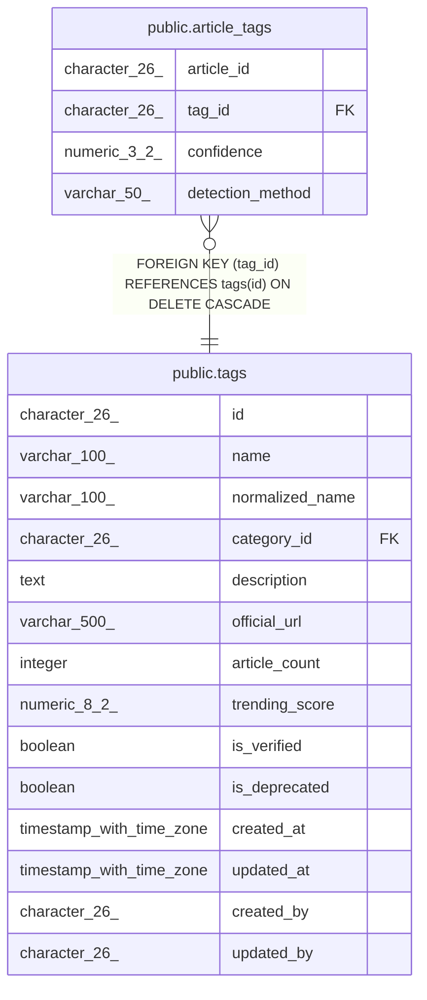

# public.article_tags

## Description

## Columns

| Name | Type | Default | Nullable | Children | Parents | Comment |
| ---- | ---- | ------- | -------- | -------- | ------- | ------- |
| article_id | character(26) |  | false |  |  |  |
| tag_id | character(26) |  | false |  | [public.tags](public.tags.md) |  |
| confidence | numeric(3,2) |  | true |  |  |  |
| detection_method | varchar(50) |  | true |  |  |  |

## Constraints

| Name | Type | Definition |
| ---- | ---- | ---------- |
| article_tags_tag_id_fkey | FOREIGN KEY | FOREIGN KEY (tag_id) REFERENCES tags(id) ON DELETE CASCADE |
| article_tags_pkey | PRIMARY KEY | PRIMARY KEY (article_id, tag_id) |

## Indexes

| Name | Definition |
| ---- | ---------- |
| article_tags_pkey | CREATE UNIQUE INDEX article_tags_pkey ON public.article_tags USING btree (article_id, tag_id) |
| idx_article_tags_article | CREATE INDEX idx_article_tags_article ON public.article_tags USING btree (article_id) |
| idx_article_tags_tag | CREATE INDEX idx_article_tags_tag ON public.article_tags USING btree (tag_id) |

## Triggers

| Name | Definition |
| ---- | ---------- |
| trigger_tag_article_count | CREATE TRIGGER trigger_tag_article_count AFTER INSERT OR DELETE ON public.article_tags FOR EACH ROW EXECUTE FUNCTION update_tag_article_count() |

## Relations

---

> Generated by [tbls](https://github.com/k1LoW/tbls)
