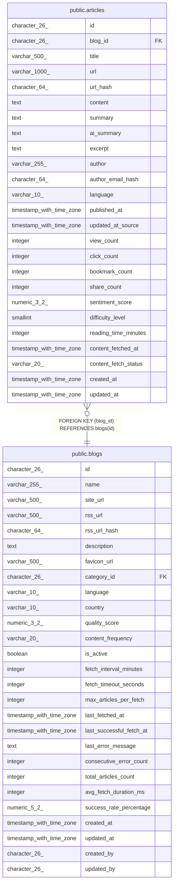

# public.articles

## Description

## Columns

| Name | Type | Default | Nullable | Children | Parents | Comment |
| ---- | ---- | ------- | -------- | -------- | ------- | ------- |
| id | character(26) | generate_ulid() | false |  |  |  |
| blog_id | character(26) |  | false |  | [public.blogs](public.blogs.md) |  |
| title | varchar(500) |  | false |  |  |  |
| url | varchar(1000) |  | false |  |  |  |
| url_hash | character(64) |  | false |  |  |  |
| content | text |  | true |  |  |  |
| summary | text |  | true |  |  |  |
| ai_summary | text |  | true |  |  |  |
| excerpt | text |  | true |  |  |  |
| author | varchar(255) |  | true |  |  |  |
| author_email_hash | character(64) |  | true |  |  |  |
| language | varchar(10) | 'ja'::character varying | true |  |  |  |
| published_at | timestamp with time zone |  | false |  |  |  |
| updated_at_source | timestamp with time zone |  | true |  |  |  |
| view_count | integer | 0 | true |  |  |  |
| click_count | integer | 0 | true |  |  |  |
| bookmark_count | integer | 0 | true |  |  |  |
| share_count | integer | 0 | true |  |  |  |
| sentiment_score | numeric(3,2) |  | true |  |  |  |
| difficulty_level | smallint |  | true |  |  |  |
| reading_time_minutes | integer |  | true |  |  |  |
| content_fetched_at | timestamp with time zone |  | true |  |  |  |
| content_fetch_status | varchar(20) | 'PENDING'::character varying | true |  |  |  |
| created_at | timestamp with time zone | now() | true |  |  |  |
| updated_at | timestamp with time zone | now() | true |  |  |  |

## Constraints

| Name | Type | Definition |
| ---- | ---- | ---------- |
| articles_blog_id_fkey | FOREIGN KEY | FOREIGN KEY (blog_id) REFERENCES blogs(id) |
| articles_pkey | PRIMARY KEY | PRIMARY KEY (id, published_at) |
| articles_url_hash_published_at_key | UNIQUE | UNIQUE (url_hash, published_at) |

## Indexes

| Name | Definition |
| ---- | ---------- |
| articles_pkey | CREATE UNIQUE INDEX articles_pkey ON ONLY public.articles USING btree (id, published_at) |
| articles_url_hash_published_at_key | CREATE UNIQUE INDEX articles_url_hash_published_at_key ON ONLY public.articles USING btree (url_hash, published_at) |

## Relations

---

> Generated by [tbls](https://github.com/k1LoW/tbls)
