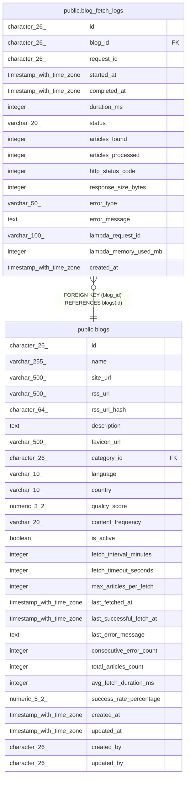

# public.blog_fetch_logs

## Description

## Columns

| Name | Type | Default | Nullable | Children | Parents | Comment |
| ---- | ---- | ------- | -------- | -------- | ------- | ------- |
| id | character(26) | generate_ulid() | false |  |  |  |
| blog_id | character(26) |  | false |  | [public.blogs](public.blogs.md) |  |
| request_id | character(26) |  | false |  |  |  |
| started_at | timestamp with time zone |  | false |  |  |  |
| completed_at | timestamp with time zone |  | true |  |  |  |
| duration_ms | integer |  | true |  |  |  |
| status | varchar(20) |  | false |  |  |  |
| articles_found | integer | 0 | true |  |  |  |
| articles_processed | integer | 0 | true |  |  |  |
| http_status_code | integer |  | true |  |  |  |
| response_size_bytes | integer |  | true |  |  |  |
| error_type | varchar(50) |  | true |  |  |  |
| error_message | text |  | true |  |  |  |
| lambda_request_id | varchar(100) |  | true |  |  |  |
| lambda_memory_used_mb | integer |  | true |  |  |  |
| created_at | timestamp with time zone | now() | true |  |  |  |

## Constraints

| Name | Type | Definition |
| ---- | ---- | ---------- |
| blog_fetch_logs_blog_id_fkey | FOREIGN KEY | FOREIGN KEY (blog_id) REFERENCES blogs(id) |
| blog_fetch_logs_pkey | PRIMARY KEY | PRIMARY KEY (id) |

## Indexes

| Name | Definition |
| ---- | ---------- |
| blog_fetch_logs_pkey | CREATE UNIQUE INDEX blog_fetch_logs_pkey ON public.blog_fetch_logs USING btree (id) |
| idx_blog_fetch_logs_blog_time | CREATE INDEX idx_blog_fetch_logs_blog_time ON public.blog_fetch_logs USING btree (blog_id, started_at DESC) |
| idx_blog_fetch_logs_status | CREATE INDEX idx_blog_fetch_logs_status ON public.blog_fetch_logs USING btree (status, started_at DESC) |

## Relations

---

> Generated by [tbls](https://github.com/k1LoW/tbls)
