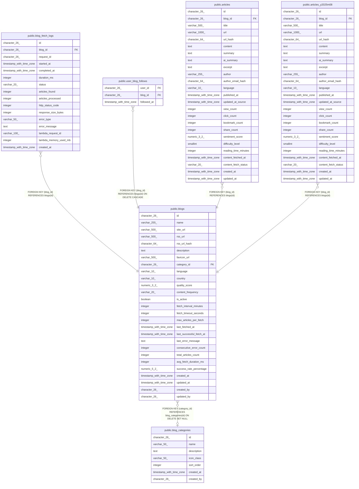

# public.blogs

## Description

## Columns

| Name | Type | Default | Nullable | Children | Parents | Comment |
| ---- | ---- | ------- | -------- | -------- | ------- | ------- |
| id | character(26) | generate_ulid() | false | [public.blog_fetch_logs](public.blog_fetch_logs.md) [public.user_blog_follows](public.user_blog_follows.md) [public.articles](public.articles.md) [public.articles_y2025m08](public.articles_y2025m08.md) |  |  |
| name | varchar(255) |  | false |  |  |  |
| site_url | varchar(500) |  | false |  |  |  |
| rss_url | varchar(500) |  | false |  |  |  |
| rss_url_hash | character(64) |  | false |  |  |  |
| description | text |  | true |  |  |  |
| favicon_url | varchar(500) |  | true |  |  |  |
| category_id | character(26) |  | true |  | [public.blog_categories](public.blog_categories.md) |  |
| language | varchar(10) | 'ja'::character varying | true |  |  |  |
| country | varchar(10) | 'JP'::character varying | true |  |  |  |
| quality_score | numeric(3,2) | 0 | true |  |  |  |
| content_frequency | varchar(20) | 'UNKNOWN'::character varying | true |  |  |  |
| is_active | boolean | true | true |  |  |  |
| fetch_interval_minutes | integer | 60 | true |  |  |  |
| fetch_timeout_seconds | integer | 30 | true |  |  |  |
| max_articles_per_fetch | integer | 50 | true |  |  |  |
| last_fetched_at | timestamp with time zone |  | true |  |  |  |
| last_successful_fetch_at | timestamp with time zone |  | true |  |  |  |
| last_error_message | text |  | true |  |  |  |
| consecutive_error_count | integer | 0 | true |  |  |  |
| total_articles_count | integer | 0 | true |  |  |  |
| avg_fetch_duration_ms | integer | 0 | true |  |  |  |
| success_rate_percentage | numeric(5,2) | 100.00 | true |  |  |  |
| created_at | timestamp with time zone | now() | true |  |  |  |
| updated_at | timestamp with time zone | now() | true |  |  |  |
| created_by | character(26) |  | true |  |  |  |
| updated_by | character(26) |  | true |  |  |  |

## Constraints

| Name | Type | Definition |
| ---- | ---- | ---------- |
| blogs_quality_score_check | CHECK | CHECK (((quality_score >= (0)::numeric) AND (quality_score <= 5.0))) |
| blogs_success_rate_check | CHECK | CHECK (((success_rate_percentage >= (0)::numeric) AND (success_rate_percentage <= 100.00))) |
| blogs_url_format_check | CHECK | CHECK ((((site_url)::text ~ '^https?://.*'::text) AND ((rss_url)::text ~ '^https?://.*'::text))) |
| blogs_category_id_fkey | FOREIGN KEY | FOREIGN KEY (category_id) REFERENCES blog_categories(id) ON DELETE SET NULL |
| blogs_pkey | PRIMARY KEY | PRIMARY KEY (id) |
| blogs_rss_url_key | UNIQUE | UNIQUE (rss_url) |
| blogs_rss_url_hash_key | UNIQUE | UNIQUE (rss_url_hash) |

## Indexes

| Name | Definition |
| ---- | ---------- |
| blogs_pkey | CREATE UNIQUE INDEX blogs_pkey ON public.blogs USING btree (id) |
| blogs_rss_url_key | CREATE UNIQUE INDEX blogs_rss_url_key ON public.blogs USING btree (rss_url) |
| blogs_rss_url_hash_key | CREATE UNIQUE INDEX blogs_rss_url_hash_key ON public.blogs USING btree (rss_url_hash) |
| idx_blogs_active_fetch | CREATE INDEX idx_blogs_active_fetch ON public.blogs USING btree (is_active, last_fetched_at) WHERE (is_active = true) |
| idx_blogs_rss_hash | CREATE UNIQUE INDEX idx_blogs_rss_hash ON public.blogs USING btree (rss_url_hash) |

## Triggers

| Name | Definition |
| ---- | ---------- |
| trigger_blogs_updated_at | CREATE TRIGGER trigger_blogs_updated_at BEFORE UPDATE ON public.blogs FOR EACH ROW EXECUTE FUNCTION update_updated_at_column() |

## Relations

---

> Generated by [tbls](https://github.com/k1LoW/tbls)
