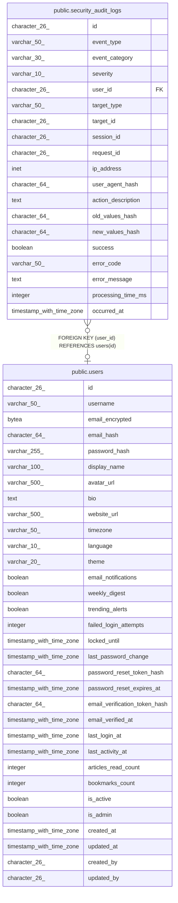

# public.security_audit_logs

## Description

## Columns

| Name | Type | Default | Nullable | Children | Parents | Comment |
| ---- | ---- | ------- | -------- | -------- | ------- | ------- |
| id | character(26) | generate_ulid() | false |  |  |  |
| event_type | varchar(50) |  | false |  |  |  |
| event_category | varchar(30) |  | false |  |  |  |
| severity | varchar(10) | 'INFO'::character varying | false |  |  |  |
| user_id | character(26) |  | true |  | [public.users](public.users.md) |  |
| target_type | varchar(50) |  | true |  |  |  |
| target_id | character(26) |  | true |  |  |  |
| session_id | character(26) |  | true |  |  |  |
| request_id | character(26) |  | false |  |  |  |
| ip_address | inet |  | false |  |  |  |
| user_agent_hash | character(64) |  | false |  |  |  |
| action_description | text |  | false |  |  |  |
| old_values_hash | character(64) |  | true |  |  |  |
| new_values_hash | character(64) |  | true |  |  |  |
| success | boolean |  | false |  |  |  |
| error_code | varchar(50) |  | true |  |  |  |
| error_message | text |  | true |  |  |  |
| processing_time_ms | integer |  | true |  |  |  |
| occurred_at | timestamp with time zone | now() | false |  |  |  |

## Constraints

| Name | Type | Definition |
| ---- | ---- | ---------- |
| audit_immutable_check | CHECK | CHECK ((occurred_at <= now())) |
| security_audit_logs_user_id_fkey | FOREIGN KEY | FOREIGN KEY (user_id) REFERENCES users(id) |
| security_audit_logs_pkey | PRIMARY KEY | PRIMARY KEY (id, occurred_at) |

## Indexes

| Name | Definition |
| ---- | ---------- |
| security_audit_logs_pkey | CREATE UNIQUE INDEX security_audit_logs_pkey ON ONLY public.security_audit_logs USING btree (id, occurred_at) |
| idx_audit_user_time | CREATE INDEX idx_audit_user_time ON ONLY public.security_audit_logs USING btree (user_id, occurred_at DESC) |
| idx_audit_event_severity | CREATE INDEX idx_audit_event_severity ON ONLY public.security_audit_logs USING btree (event_type, severity, occurred_at DESC) |
| idx_audit_ip_time | CREATE INDEX idx_audit_ip_time ON ONLY public.security_audit_logs USING btree (ip_address, occurred_at DESC) |
| idx_audit_failed_auth | CREATE INDEX idx_audit_failed_auth ON ONLY public.security_audit_logs USING btree (event_category, success, occurred_at DESC) WHERE (((event_category)::text = 'AUTH'::text) AND (success = false)) |

## Relations

---

> Generated by [tbls](https://github.com/k1LoW/tbls)
