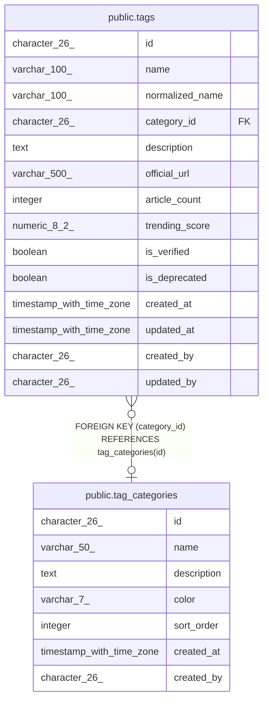

# public.tag_categories

## Description

## Columns

| Name | Type | Default | Nullable | Children | Parents | Comment |
| ---- | ---- | ------- | -------- | -------- | ------- | ------- |
| id | character(26) | generate_ulid() | false | [public.tags](public.tags.md) |  |  |
| name | varchar(50) |  | false |  |  |  |
| description | text |  | true |  |  |  |
| color | varchar(7) | '#6B7280'::character varying | true |  |  |  |
| sort_order | integer | 0 | true |  |  |  |
| created_at | timestamp with time zone | now() | true |  |  |  |
| created_by | character(26) |  | true |  |  |  |

## Constraints

| Name | Type | Definition |
| ---- | ---- | ---------- |
| tag_categories_pkey | PRIMARY KEY | PRIMARY KEY (id) |
| tag_categories_name_key | UNIQUE | UNIQUE (name) |

## Indexes

| Name | Definition |
| ---- | ---------- |
| tag_categories_pkey | CREATE UNIQUE INDEX tag_categories_pkey ON public.tag_categories USING btree (id) |
| tag_categories_name_key | CREATE UNIQUE INDEX tag_categories_name_key ON public.tag_categories USING btree (name) |

## Relations

---

> Generated by [tbls](https://github.com/k1LoW/tbls)
