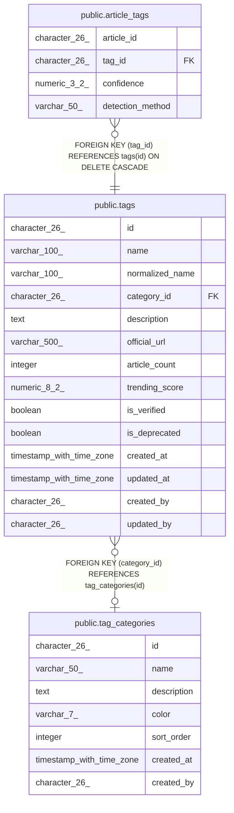

# public.tags

## Description

## Columns

| Name | Type | Default | Nullable | Children | Parents | Comment |
| ---- | ---- | ------- | -------- | -------- | ------- | ------- |
| id | character(26) | generate_ulid() | false | [public.article_tags](public.article_tags.md) |  |  |
| name | varchar(100) |  | false |  |  |  |
| normalized_name | varchar(100) |  | false |  |  |  |
| category_id | character(26) |  | true |  | [public.tag_categories](public.tag_categories.md) |  |
| description | text |  | true |  |  |  |
| official_url | varchar(500) |  | true |  |  |  |
| article_count | integer | 0 | true |  |  |  |
| trending_score | numeric(8,2) | 0 | true |  |  |  |
| is_verified | boolean | false | true |  |  |  |
| is_deprecated | boolean | false | true |  |  |  |
| created_at | timestamp with time zone | now() | true |  |  |  |
| updated_at | timestamp with time zone | now() | true |  |  |  |
| created_by | character(26) |  | true |  |  |  |
| updated_by | character(26) |  | true |  |  |  |

## Constraints

| Name | Type | Definition |
| ---- | ---- | ---------- |
| tags_category_id_fkey | FOREIGN KEY | FOREIGN KEY (category_id) REFERENCES tag_categories(id) |
| tags_pkey | PRIMARY KEY | PRIMARY KEY (id) |
| tags_name_key | UNIQUE | UNIQUE (name) |
| tags_normalized_name_key | UNIQUE | UNIQUE (normalized_name) |

## Indexes

| Name | Definition |
| ---- | ---------- |
| tags_pkey | CREATE UNIQUE INDEX tags_pkey ON public.tags USING btree (id) |
| tags_name_key | CREATE UNIQUE INDEX tags_name_key ON public.tags USING btree (name) |
| tags_normalized_name_key | CREATE UNIQUE INDEX tags_normalized_name_key ON public.tags USING btree (normalized_name) |
| idx_tags_normalized_name | CREATE INDEX idx_tags_normalized_name ON public.tags USING btree (normalized_name) |
| idx_tags_trending_score | CREATE INDEX idx_tags_trending_score ON public.tags USING btree (trending_score DESC) |

## Triggers

| Name | Definition |
| ---- | ---------- |
| trigger_tags_updated_at | CREATE TRIGGER trigger_tags_updated_at BEFORE UPDATE ON public.tags FOR EACH ROW EXECUTE FUNCTION update_updated_at_column() |

## Relations

---

> Generated by [tbls](https://github.com/k1LoW/tbls)
