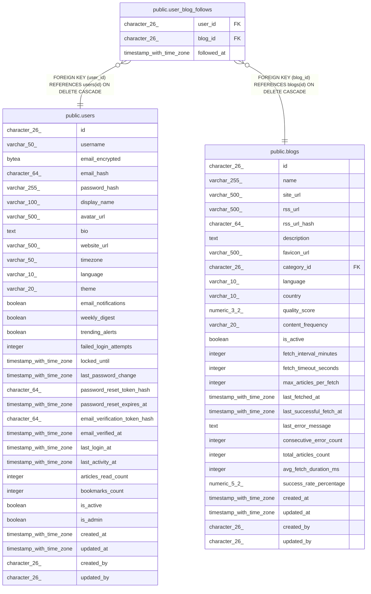

# public.user_blog_follows

## Description

## Columns

| Name | Type | Default | Nullable | Children | Parents | Comment |
| ---- | ---- | ------- | -------- | -------- | ------- | ------- |
| user_id | character(26) |  | false |  | [public.users](public.users.md) |  |
| blog_id | character(26) |  | false |  | [public.blogs](public.blogs.md) |  |
| followed_at | timestamp with time zone | now() | true |  |  |  |

## Constraints

| Name | Type | Definition |
| ---- | ---- | ---------- |
| user_blog_follows_blog_id_fkey | FOREIGN KEY | FOREIGN KEY (blog_id) REFERENCES blogs(id) ON DELETE CASCADE |
| user_blog_follows_user_id_fkey | FOREIGN KEY | FOREIGN KEY (user_id) REFERENCES users(id) ON DELETE CASCADE |
| user_blog_follows_pkey | PRIMARY KEY | PRIMARY KEY (user_id, blog_id) |

## Indexes

| Name | Definition |
| ---- | ---------- |
| user_blog_follows_pkey | CREATE UNIQUE INDEX user_blog_follows_pkey ON public.user_blog_follows USING btree (user_id, blog_id) |
| idx_user_blog_follows_user | CREATE INDEX idx_user_blog_follows_user ON public.user_blog_follows USING btree (user_id) |
| idx_user_blog_follows_blog | CREATE INDEX idx_user_blog_follows_blog ON public.user_blog_follows USING btree (blog_id) |

## Relations

---

> Generated by [tbls](https://github.com/k1LoW/tbls)
