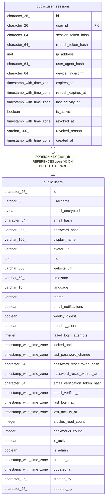

# public.user_sessions

## Description

## Columns

| Name | Type | Default | Nullable | Children | Parents | Comment |
| ---- | ---- | ------- | -------- | -------- | ------- | ------- |
| id | character(26) | generate_ulid() | false |  |  |  |
| user_id | character(26) |  | false |  | [public.users](public.users.md) |  |
| session_token_hash | character(64) |  | false |  |  |  |
| refresh_token_hash | character(64) |  | true |  |  |  |
| ip_address | inet |  | false |  |  |  |
| user_agent_hash | character(64) |  | false |  |  |  |
| device_fingerprint | character(64) |  | true |  |  |  |
| expires_at | timestamp with time zone |  | false |  |  |  |
| refresh_expires_at | timestamp with time zone |  | true |  |  |  |
| last_activity_at | timestamp with time zone | now() | true |  |  |  |
| is_active | boolean | true | true |  |  |  |
| revoked_at | timestamp with time zone |  | true |  |  |  |
| revoked_reason | varchar(100) |  | true |  |  |  |
| created_at | timestamp with time zone | now() | true |  |  |  |

## Constraints

| Name | Type | Definition |
| ---- | ---- | ---------- |
| sessions_expires_check | CHECK | CHECK ((expires_at > created_at)) |
| user_sessions_user_id_fkey | FOREIGN KEY | FOREIGN KEY (user_id) REFERENCES users(id) ON DELETE CASCADE |
| user_sessions_pkey | PRIMARY KEY | PRIMARY KEY (id) |
| user_sessions_session_token_hash_key | UNIQUE | UNIQUE (session_token_hash) |

## Indexes

| Name | Definition |
| ---- | ---------- |
| user_sessions_pkey | CREATE UNIQUE INDEX user_sessions_pkey ON public.user_sessions USING btree (id) |
| user_sessions_session_token_hash_key | CREATE UNIQUE INDEX user_sessions_session_token_hash_key ON public.user_sessions USING btree (session_token_hash) |
| idx_sessions_token_hash | CREATE UNIQUE INDEX idx_sessions_token_hash ON public.user_sessions USING btree (session_token_hash) |
| idx_sessions_user_active | CREATE INDEX idx_sessions_user_active ON public.user_sessions USING btree (user_id, is_active, last_activity_at DESC) |
| idx_sessions_expires | CREATE INDEX idx_sessions_expires ON public.user_sessions USING btree (expires_at) WHERE (is_active = true) |
| idx_sessions_cleanup | CREATE INDEX idx_sessions_cleanup ON public.user_sessions USING btree (expires_at, is_active) WHERE (is_active = false) |

## Triggers

| Name | Definition |
| ---- | ---------- |
| trigger_reset_failed_attempts | CREATE TRIGGER trigger_reset_failed_attempts AFTER INSERT ON public.user_sessions FOR EACH ROW EXECUTE FUNCTION reset_failed_attempts_on_success() |

## Relations

---

> Generated by [tbls](https://github.com/k1LoW/tbls)
