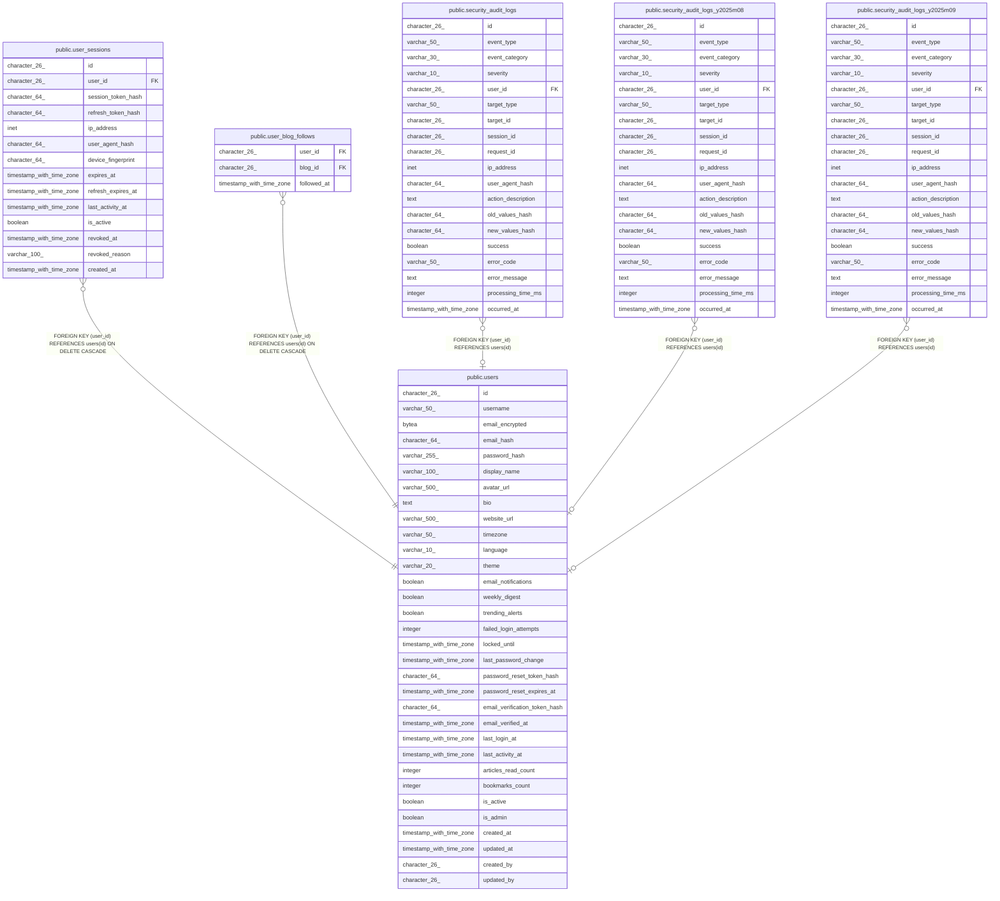

# public.users

## Description

## Columns

| Name | Type | Default | Nullable | Children | Parents | Comment |
| ---- | ---- | ------- | -------- | -------- | ------- | ------- |
| id | character(26) | generate_ulid() | false | [public.user_sessions](public.user_sessions.md) [public.user_blog_follows](public.user_blog_follows.md) [public.security_audit_logs](public.security_audit_logs.md) [public.security_audit_logs_y2025m08](public.security_audit_logs_y2025m08.md) [public.security_audit_logs_y2025m09](public.security_audit_logs_y2025m09.md) |  |  |
| username | varchar(50) |  | false |  |  |  |
| email_encrypted | bytea |  | false |  |  |  |
| email_hash | character(64) |  | false |  |  |  |
| password_hash | varchar(255) |  | false |  |  |  |
| display_name | varchar(100) |  | true |  |  |  |
| avatar_url | varchar(500) |  | true |  |  |  |
| bio | text |  | true |  |  |  |
| website_url | varchar(500) |  | true |  |  |  |
| timezone | varchar(50) | 'Asia/Tokyo'::character varying | true |  |  |  |
| language | varchar(10) | 'ja'::character varying | true |  |  |  |
| theme | varchar(20) | 'system'::character varying | true |  |  |  |
| email_notifications | boolean | true | true |  |  |  |
| weekly_digest | boolean | true | true |  |  |  |
| trending_alerts | boolean | false | true |  |  |  |
| failed_login_attempts | integer | 0 | true |  |  |  |
| locked_until | timestamp with time zone |  | true |  |  |  |
| last_password_change | timestamp with time zone | now() | true |  |  |  |
| password_reset_token_hash | character(64) |  | true |  |  |  |
| password_reset_expires_at | timestamp with time zone |  | true |  |  |  |
| email_verification_token_hash | character(64) |  | true |  |  |  |
| email_verified_at | timestamp with time zone |  | true |  |  |  |
| last_login_at | timestamp with time zone |  | true |  |  |  |
| last_activity_at | timestamp with time zone |  | true |  |  |  |
| articles_read_count | integer | 0 | true |  |  |  |
| bookmarks_count | integer | 0 | true |  |  |  |
| is_active | boolean | true | true |  |  |  |
| is_admin | boolean | false | true |  |  |  |
| created_at | timestamp with time zone | now() | true |  |  |  |
| updated_at | timestamp with time zone | now() | true |  |  |  |
| created_by | character(26) |  | true |  |  |  |
| updated_by | character(26) |  | true |  |  |  |

## Constraints

| Name | Type | Definition |
| ---- | ---- | ---------- |
| users_lock_duration_check | CHECK | CHECK (((locked_until IS NULL) OR (locked_until > now()))) |
| users_password_strength_check | CHECK | CHECK ((length((password_hash)::text) >= 60)) |
| users_pkey | PRIMARY KEY | PRIMARY KEY (id) |
| users_username_key | UNIQUE | UNIQUE (username) |
| users_email_hash_key | UNIQUE | UNIQUE (email_hash) |

## Indexes

| Name | Definition |
| ---- | ---------- |
| users_pkey | CREATE UNIQUE INDEX users_pkey ON public.users USING btree (id) |
| users_username_key | CREATE UNIQUE INDEX users_username_key ON public.users USING btree (username) |
| users_email_hash_key | CREATE UNIQUE INDEX users_email_hash_key ON public.users USING btree (email_hash) |
| idx_users_email_hash | CREATE UNIQUE INDEX idx_users_email_hash ON public.users USING btree (email_hash) |
| idx_users_username_lower | CREATE UNIQUE INDEX idx_users_username_lower ON public.users USING btree (lower((username)::text)) |
| idx_users_failed_attempts | CREATE INDEX idx_users_failed_attempts ON public.users USING btree (failed_login_attempts) WHERE (failed_login_attempts > 0) |
| idx_users_locked | CREATE INDEX idx_users_locked ON public.users USING btree (locked_until) WHERE (locked_until IS NOT NULL) |

## Triggers

| Name | Definition |
| ---- | ---------- |
| trigger_password_change_audit | CREATE TRIGGER trigger_password_change_audit AFTER UPDATE ON public.users FOR EACH ROW EXECUTE FUNCTION log_password_change() |
| trigger_users_updated_at | CREATE TRIGGER trigger_users_updated_at BEFORE UPDATE ON public.users FOR EACH ROW EXECUTE FUNCTION update_updated_at_column() |

## Relations

---

> Generated by [tbls](https://github.com/k1LoW/tbls)
